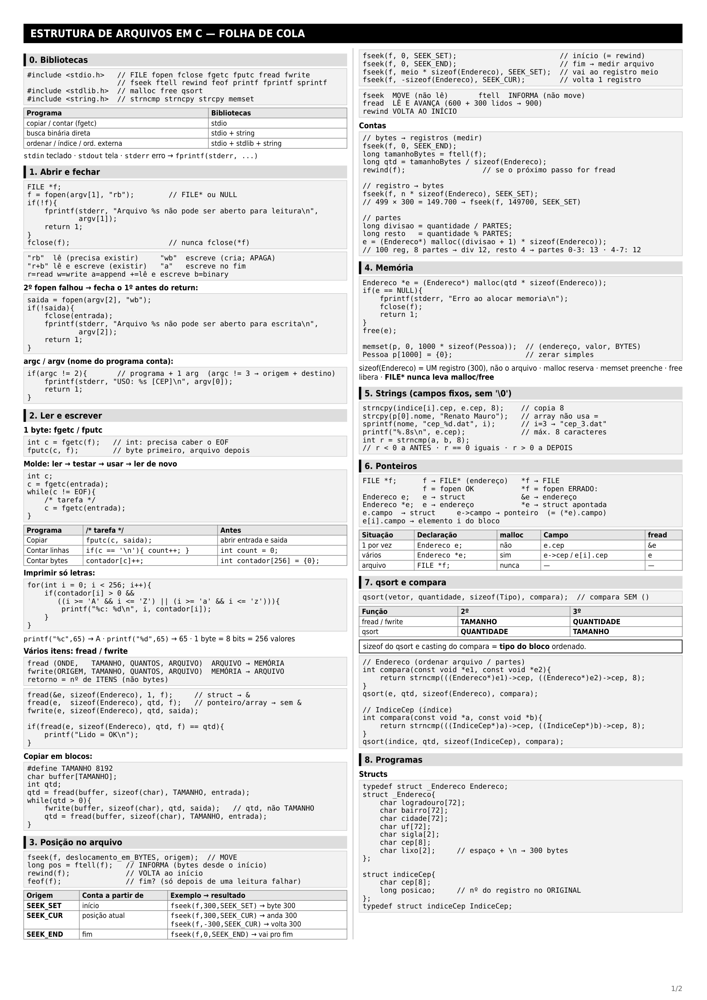
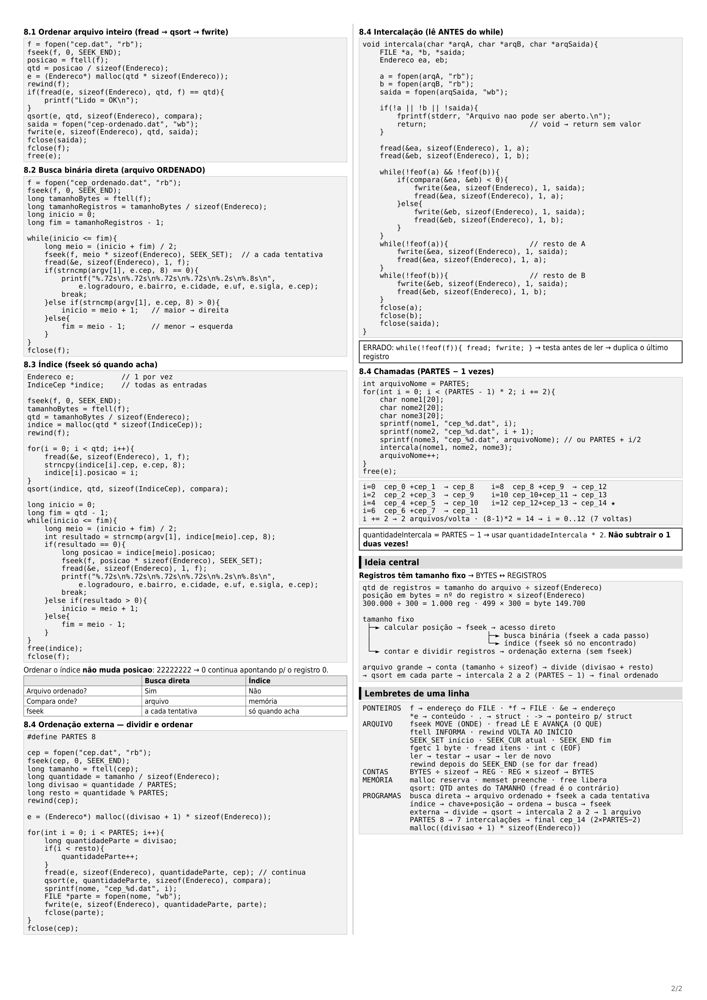

# 📁 Estrutura de Arquivos em C — Material de Prova

Material de revisão sobre arquivos, registros, memória, ponteiros, busca, índices e ordenação externa em C.

| Parte | O que tem | Quando usar |
| --- | --- | --- |
| **1. Funções** | Ficha de cada função: o que faz, parâmetros, retorno, cuidado | Folha de cola |
| **2. Conceitos** | Ponteiros, struct, memória, as duas contas | Entender o "porquê" |
| **3. Programas** | As receitas completas, passo a passo | Treinar para a prova |
| **4. Pegadinhas** | Checklist do que costumo errar | Revisão da véspera |
| **5. Folha de cola** | Tudo condensado, pronto para copiar | Montar a cola |

---

## 📑 Sumário

* [Parte 1 — Funções principais](#parte-1--funções-principais)

  * [1.1 `fopen` e `fclose`](#11-fopen-e-fclose)
  * [1.2 `fgetc` e `fputc`](#12-fgetc-e-fputc)
  * [1.3 `fread` e `fwrite`](#13-fread-e-fwrite)
  * [1.4 `fseek`, `ftell`, `rewind` e `feof`](#14-fseek-ftell-rewind-e-feof)
  * [1.5 `malloc`, `free`, `sizeof` e `memset`](#15-malloc-free-sizeof-e-memset)
  * [1.6 Strings](#16-strings)
  * [1.7 `qsort` e `compara`](#17-qsort-e-compara)

* [Parte 2 — Conceitos fundamentais](#parte-2--conceitos-fundamentais)

  * [2.1 `FILE` e ponteiros](#21-file-e-ponteiros)
  * [2.2 `struct` e `typedef`](#22-struct-e-typedef)
  * [2.3 `Tipo x` × `Tipo *x`](#23-tipo-x--tipo-x)
  * [2.4 `.` × `->` e `&` × `*`](#24---e--)
  * [2.5 Bytes × registros](#25-bytes--registros)
  * [2.6 Bytes e ASCII](#26-bytes-e-ascii)
  * [2.7 `argc` e `argv`](#27-argc-e-argv)

* [Parte 3 — Programas](#parte-3--programas)

  * [3.1 Ler byte a byte](#31-ler-byte-a-byte)
  * [3.2 Ordenar um arquivo inteiro](#32-ordenar-um-arquivo-inteiro)
  * [3.3 Busca binária diretamente no arquivo](#33-busca-binária-diretamente-no-arquivo)
  * [3.4 Índice](#34-índice)
  * [3.5 Ordenação externa](#35-ordenação-externa)

    * [Etapa 1 — Dividir o arquivo](#etapa-1--dividir-o-arquivo)
    * [Etapa 2 — Ordenar cada parte](#etapa-2--ordenar-cada-parte)
    * [Etapa 3 — Intercalar](#etapa-3--intercalar)
    * [Etapa 4 — Repetir as intercalações](#etapa-4--repetir-as-intercalações)

* [Parte 4 — Checklist de pegadinhas](#parte-4--checklist-de-pegadinhas)

* [Parte 5 — Folha de cola](#parte-5--folha-de-cola)

* [📄 Folha de cola — Estrutura de Arquivos](#-folha-de-cola--estrutura-de-arquivos)
---

# Parte 1 — Funções principais

A ideia desta parte é saber **o que cada função faz e como usá-la**.

---

## 1.1 `fopen` e `fclose`

### `fopen` — abre um arquivo

```c
FILE *f = fopen(nome, modo);
```

* **Recebe:** o nome do arquivo e o modo de abertura.
* **Devolve:** um `FILE *` (ponteiro para o arquivo aberto) ou `NULL` se falhar.

Exemplo:

```c
FILE *f = fopen("cep.dat", "rb");

if (f == NULL) {
    printf("Erro ao abrir arquivo\n");
    return 1;
}
```

Também podemos escrever:

```c
if (!f) {
    ...
}
```

### Modos

| Modo  |  Lê |   Escreve  | Cria se não existir | Apaga o conteúdo |
| ----- | :-: | :--------: | :-----------------: | :--------------: |
| `rb`  |  ✅  |      ❌     |          ❌          |         ❌        |
| `wb`  |  ❌  |      ✅     |          ✅          |    ⚠️ **SIM**    |
| `a`   |  ❌  | ✅ no final |          ✅          |         ❌        |
| `r+b` |  ✅  |      ✅     |          ❌          |         ❌        |
| `w+`  |  ✅  |      ✅     |          ✅          |    ⚠️ **SIM**    |

Macete:

```text
r = read
w = write
a = append
+ = lê e escreve
b = binary
```

### ⚠️ Cuidados

* `w` e `wb` **apagam o conteúdo anterior** se o arquivo já existir.
* Arquivos com registros/`struct` → usar modo **binário** (`rb`, `wb`, `r+b`).
* `fopen` devolve `FILE *`.

```c
FILE *f = fopen(...);   // ✅
*f = fopen(...);        // ❌
```

A explicação do `*` está na Parte 2.

---

### `fclose` — fecha o arquivo

```c
fclose(f);
```

* **Recebe:** o `FILE *`.
* Fecha o arquivo e garante que os dados que estavam no buffer sejam gravados.

```c
fclose(f);      // ✅
fclose(*f);     // ❌
```

### ⚠️ Cuidados

Todo `fopen` precisa de seu `fclose`.

Se você abriu vários arquivos e o segundo `fopen` falhar, precisa fechar o primeiro antes de sair:

```c
entrada = fopen(argv[1], "rb");

if (!entrada)
    return 1;

saida = fopen(argv[2], "wb");

if (!saida) {
    fclose(entrada);
    return 1;
}
```

Na ordenação externa, as partes são fechadas depois de serem gravadas porque serão **reabertas posteriormente** pela função de intercalação.

---

# 1.2 `fgetc` e `fputc`

## `fgetc` — lê 1 byte

```text
ARQUIVO → MEMÓRIA
```

```c
int c = fgetc(f);
```

Devolve:

* o byte lido (`0` a `255`);
* ou `EOF` quando não há mais dados.

### `fputc` — escreve 1 byte

```text
MEMÓRIA → ARQUIVO
```

```c
fputc(c, f);
```

A ordem dos parâmetros é:

```c
fputc(byte, arquivo);
```

### ⚠️ Por que `int c`?

Use:

```c
int c;
```

e não:

```c
char c;
```

O `fgetc` precisa conseguir representar:

```text
256 valores de byte + EOF
```

Por isso usa `int`.

### `EOF`

`EOF` significa *End Of File*.

Ele **não é um caractere gravado no arquivo**. É um valor especial devolvido pela função para indicar que a leitura chegou ao fim.

---

# 1.3 `fread` e `fwrite`

Essas funções trabalham com registros e vários itens.

```text
fread  → ARQUIVO ──► MEMÓRIA
fwrite → MEMÓRIA ──► ARQUIVO
```

## `fread`

```c
fread(destino, sizeof(Tipo), quantidade, arquivo);
```

## `fwrite`

```c
fwrite(origem, sizeof(Tipo), quantidade, arquivo);
```

### Os 4 parâmetros

Uma forma fácil de lembrar:

> **ONDE? TAMANHO? QUANTOS? QUAL ARQUIVO?**

| # | Parâmetro      | `fread`                     | `fwrite`                         |
| - | -------------- | --------------------------- | -------------------------------- |
| 1 | endereço       | onde colocar o que foi lido | de onde pegar o que será gravado |
| 2 | `sizeof(Tipo)` | tamanho de um item          | tamanho de um item               |
| 3 | quantidade     | quantos itens ler           | quantos itens gravar             |
| 4 | `FILE *`       | arquivo aberto              | arquivo aberto                   |

### Retorno

`fread` e `fwrite` retornam a quantidade de **itens** processados, e não a quantidade de bytes.

Exemplo:

```c
fread(v, sizeof(Endereco), 100, f);
```

Se ler 100 registros:

```text
retorno = 100
```

e não o número de bytes ocupados pelos 100 registros.

### Exemplos

Uma struct:

```c
Endereco e;

fread(&e, sizeof(Endereco), 1, f);
```

Usamos `&e` porque `e` é uma variável comum.

Um bloco:

```c
Endereco *v = malloc(qtd * sizeof(Endereco));

fread(v, sizeof(Endereco), qtd, f);
```

Aqui `v` já é um endereço.

Um array:

```c
Pessoa p[1000];

fwrite(p, sizeof(Pessoa), 1000, f);
```

O nome do array também já representa um endereço.

Podemos verificar se tudo foi lido:

```c
if (fread(v, sizeof(Endereco), qtd, f) == qtd)
    printf("Lido = OK\n");
```

### ⚠️ Cuidados

* `fread`/`fwrite` retornam **itens**, não bytes.
* `fread` **não abre arquivo**.

Errado:

```c
fread(&e, sizeof(Endereco), 1, "cep_0.dat");
```

Certo:

```c
FILE *f = fopen("cep_0.dat", "rb");
fread(&e, sizeof(Endereco), 1, f);
```

* `fread` lê a partir da **posição atual** do arquivo e depois avança essa posição.
* Uma chamada depois da outra lê registros seguintes.
* `fread` copia os bytes do registro inteiro. A `struct` é que dá significado a esses bytes.

### `&` no `fread`

Regra prática:

```text
struct simples → &e
ponteiro → e
array → array
```

Exemplo:

```c
Endereco e;
fread(&e, sizeof(Endereco), 1, f);
```

mas:

```c
Endereco *e;
fread(e, sizeof(Endereco), 1, f);
```

---

# 1.4 `fseek`, `ftell`, `rewind` e `feof`

Todo arquivo aberto possui uma **posição atual**.

Imagine uma cabeça de leitura:

```text
ARQUIVO
┌────┬────┬────┬────┬────┬────┐
│ 00 │ 01 │ 02 │ 03 │ 04 │ 05 │
└────┴────┴────┴────┴────┴────┘
          ↑
       posição
```

A posição muda conforme fazemos leituras e escritas.

---

## `fseek` — MOVE a posição

```c
fseek(arquivo, deslocamento, origem);
```

O deslocamento é em **bytes**.

| Origem     | Conta a partir de | Exemplo                   |
| ---------- | ----------------- | ------------------------- |
| `SEEK_SET` | início            | `fseek(f, 300, SEEK_SET)` |
| `SEEK_CUR` | posição atual     | `fseek(f, -2, SEEK_CUR)`  |
| `SEEK_END` | final             | `fseek(f, 0, SEEK_END)`   |

Exemplo:

```c
fseek(f, 300, SEEK_SET);
```

Significa:

> Vá para o byte 300 contando a partir do início.

---

## `ftell` — INFORMA a posição

```c
long pos = ftell(f);
```

Retorna a posição atual em bytes desde o início.

---

## `rewind` — volta para o começo

```c
rewind(f);
```

É muito usado depois de:

```c
fseek(f, 0, SEEK_END);
ftell(f);
```

porque depois disso o arquivo está no final.

---

## `feof` — testa o fim do arquivo

```c
feof(f);
```

Pode aparecer:

```c
while (!feof(f)) {
    ...
}
```

Mas existe uma pegadinha importante:

> `feof` só fica verdadeiro **depois que uma leitura tenta passar do fim do arquivo**.

Por isso, no modelo de intercalação usado na aula, fazemos:

```text
LER
 ↓
TESTAR
 ↓
USAR
 ↓
LER DE NOVO
```

### `EOF` × `feof`

|           | O que é                                     | Exemplo            |
| --------- | ------------------------------------------- | ------------------ |
| `EOF`     | valor devolvido pelo `fgetc`                | `if (c == EOF)`    |
| `feof(f)` | função que testa o estado de fim do arquivo | `while (!feof(f))` |

---

## Combinação: descobrir quantidade de registros

Se todos os registros têm o mesmo tamanho:

```c
fseek(f, 0, SEEK_END);
long bytes = ftell(f);
long qtd = bytes / sizeof(Endereco);
rewind(f);
```

A lógica é:

```text
arquivo
   ↓
fseek → vai para o final
   ↓
ftell → descobre quantos BYTES existem
   ↓
÷ sizeof(Endereco)
   ↓
descobre quantos REGISTROS existem
   ↓
rewind → volta ao começo
```

### ⚠️ Cuidados

* `fseek` **move**.
* `ftell` **informa**.
* `fread` **lê e avança**.
* `fseek` trabalha em **bytes**.

Para ir ao registro `n`:

```c
fseek(f, n * sizeof(Endereco), SEEK_SET);
```

Não:

```c
fseek(f, n, SEEK_SET);    // ❌
```

* Depois de `SEEK_END` + `ftell`, lembrar do `rewind`.

---

# 1.5 `malloc`, `free`, `sizeof` e `memset`

## `malloc` — reserva memória

```c
Endereco *e = malloc(qtd * sizeof(Endereco));
```

Em C, o casting não é necessário:

```c
Endereco *e = malloc(qtd * sizeof(Endereco));
```

Também funciona:

```c
Endereco *e = (Endereco*) malloc(qtd * sizeof(Endereco));
```

Mas o primeiro é mais simples e idiomático em C.

### O que `malloc` faz?

Recebe a quantidade de **bytes** que queremos reservar.

Devolve o endereço do início do bloco:

```text
malloc
  ↓
┌─────────────────────────────┐
│ espaço reservado na memória │
└─────────────────────────────┘
↑
endereço devolvido
```

Se não conseguir reservar:

```c
NULL
```

Exemplo:

```c
Endereco *e = malloc(qtd * sizeof(Endereco));

if (e == NULL) {
    fprintf(stderr, "Erro ao alocar memoria\n");
    fclose(f);
    return 1;
}
```

O `malloc` não preenche os registros. O conteúdo será colocado, por exemplo, pelo `fread`.

---

## `free` — libera memória

Todo `malloc` deve ter seu `free`:

```c
free(e);
```

```text
malloc → reserva
free   → libera
```

---

## `sizeof` — tamanho em bytes

```c
sizeof(Endereco)
```

significa:

> tamanho de **um** `Endereco` em bytes.

Não significa o tamanho do arquivo.

Exemplo:

```text
sizeof(Endereco) = 300
```

Se tivermos 1000 registros:

```text
1000 × sizeof(Endereco)
= 1000 × 300
= 300000 bytes
```

---

## `memset` — preenche uma região da memória

```c
memset(endereco, valor, quantidade_de_BYTES);
```

Exemplo:

```c
memset(p, 0, 1000 * sizeof(Pessoa));
```

Para um array local:

```c
Pessoa p[1000] = {0};
```

é uma forma simples de inicializá-lo com zero.

Também:

```c
memset(p, 0, sizeof(p));
```

se `p` for realmente um array local.

### ⚠️ Cuidados

* Testar `malloc == NULL`.
* Todo `malloc` tem `free`.
* `FILE *` não usa `malloc`/`free`; usa `fopen`/`fclose`.
* Array local não é automaticamente preenchido com zero.
* `memset` trabalha em **bytes**.

---

# 1.6 Strings

As funções mais importantes aqui são:

```text
strcpy
strncpy
strncmp
sprintf
printf
```

---

## `strcpy` e `strncpy`

Servem para copiar texto para um `char[]`.

```c
strcpy(p[0].nome, "Renato Mauro");
```

```c
strncpy(indice[i].cep, e.cep, 8);
```

Também podemos ler texto:

```c
fgets(p[0].nome, 40, stdin);
```

### ⚠️ Array não pode receber atribuição direta

Errado:

```c
p[0].nome = "Renato Mauro";
```

Certo:

```c
strcpy(p[0].nome, "Renato Mauro");
```

ou:

```c
strncpy(...);
```

---

## `strncmp` — compara os primeiros N caracteres

```c
int r = strncmp(a, b, 8);
```

Resultado:

| Resultado | Significado           |
| --------- | --------------------- |
| `r < 0`   | `a` vem antes de `b`  |
| `r == 0`  | são iguais            |
| `r > 0`   | `a` vem depois de `b` |

Por isso podemos usar:

```c
if (compara(&ea, &eb) < 0)
```

para saber qual CEP vem primeiro.

---

## `sprintf` — monta uma string

```c
char nome[20];

sprintf(nome, "cep_%d.dat", i);
```

Se:

```c
i = 3;
```

teremos:

```text
nome = "cep_3.dat"
```

É usado na ordenação externa para gerar os nomes dos arquivos.

---

## `printf` com precisão

Para campos de tamanho fixo:

```c
printf("%.8s\n", e.cep);
```

significa imprimir no máximo 8 caracteres.

Também:

```c
printf("%c", 65);
```

imprime:

```text
A
```

enquanto:

```c
printf("%d", 65);
```

imprime:

```text
65
```

O valor é o mesmo; muda apenas a forma de interpretação/impressão.

### ⚠️ Campos de tamanho fixo

Na struct:

```c
char cep[8];
```

não temos necessariamente um `'\0'` dentro desses 8 bytes.

Por isso usamos:

```c
strncmp(..., 8);
strncpy(..., 8);
printf("%.8s", ...);
```

quando trabalhamos com esses campos fixos.

---

# 1.7 `qsort` e `compara`

## `qsort` — ordena um bloco na memória

```c
qsort(onde, quantidade, sizeof(Tipo), compara);
```

Os quatro parâmetros:

| # | Parâmetro             | Exemplo            |
| - | --------------------- | ------------------ |
| 1 | onde começam os itens | `e`                |
| 2 | quantos itens         | `qtd`              |
| 3 | tamanho de um item    | `sizeof(Endereco)` |
| 4 | função de comparação  | `compara`          |

Exemplo:

```c
qsort(e, qtd, sizeof(Endereco), compara);
```

### ⚠️ A função vai sem parênteses

Certo:

```c
qsort(e, qtd, sizeof(Endereco), compara);
```

Errado:

```c
qsort(e, qtd, sizeof(Endereco), compara());
```

O `qsort` recebe o **nome da função** para poder chamá-la quando precisar.

---

## A função `compara`

```c
int compara(const void *e1, const void *e2){
    return strncmp(
        ((Endereco*)e1)->cep,
        ((Endereco*)e2)->cep,
        8
    );
}
```

O `qsort` é genérico, então ele recebe:

```c
const void *
```

Isso significa, de forma simplificada:

> "Não sei qual é o tipo dos dados; você me diz."

Então fazemos o casting:

```c
(Endereco*)e1
```

para dizer:

> "Trate esse endereço como um `Endereco *`."

Depois:

```c
((Endereco*)e1)->cep
```

acessa o campo `cep`.

Por fim:

```c
strncmp(..., ..., 8)
```

compara os CEPs.

---

## Chave numérica

Se a chave fosse numérica, não usaríamos `strncmp`.

Exemplo:

```c
int comparaNumero(const void *a, const void *b){
    long x = ((Registro*)a)->valor;
    long y = ((Registro*)b)->valor;

    if (x < y) return -1;
    if (x > y) return 1;

    return 0;
}
```

### ⚠️ Cuidado

O tipo usado no:

```c
sizeof(Tipo)
```

e no casting dentro de `compara` deve corresponder ao tipo que está sendo ordenado.

Exemplo:

```c
qsort(indice, qtd, sizeof(IndiceCep), compara);
```

Nesse caso, a função precisa tratar os dados como `IndiceCep *`, e não como `Endereco *`.

---

# Parte 2 — Conceitos fundamentais

Agora que as funções estão conhecidas, esta parte explica **por que o código funciona**.

---

# 2.1 `FILE` e ponteiros

`FILE` é um tipo da `stdio.h` usado para controlar um arquivo aberto.

Ele mantém informações como:

* posição atual;
* buffer;
* estado do arquivo;
* erros;
* fim do arquivo.

Normalmente não mexemos diretamente nesses campos.

Declaramos:

```c
FILE *f;
```

Isso significa:

> `f` é um ponteiro para `FILE`.

---

## `f` × `*f`

Mesma lógica de qualquer ponteiro:

```c
int x = 10;
int *p = &x;
```

Visualmente:

```text
p  → endereço de x
*p → valor de x
```

Para `FILE`:

```text
f  → endereço de um FILE
*f → o FILE naquele endereço
```

| Expressão | Tipo     | Significado                |
| --------- | -------- | -------------------------- |
| `f`       | `FILE *` | endereço guardado          |
| `*f`      | `FILE`   | estrutura naquele endereço |

Por isso:

```c
f = fopen(...);
```

está correto, porque `fopen` devolve `FILE *`.

Já:

```c
*f = fopen(...);
```

está errado, porque `*f` é um `FILE`, enquanto `fopen` devolve `FILE *`.

---

## O `*` tem dois usos

Na declaração:

```c
FILE *f;
```

significa:

> `f` é ponteiro.

Em uma expressão:

```c
*f
```

significa:

> vá até o endereço guardado em `f`.

---

# 2.2 `struct` e `typedef`

Uma `struct` agrupa vários campos.

Exemplo:

```c
typedef struct _Endereco Endereco;

struct _Endereco {
    char logradouro[72];
    char bairro[72];
    char cidade[72];
    char uf[72];
    char sigla[2];
    char cep[8];
    char lixo[2];
};
```

O `typedef` cria um apelido:

```c
Endereco
```

para:

```c
struct _Endereco
```

Assim podemos escrever:

```c
Endereco e;
```

em vez de:

```c
struct _Endereco e;
```

### Campos

```text
logradouro → 72
bairro     → 72
cidade     → 72
uf         → 72
sigla      → 2
cep        → 8
lixo       → 2
```

A soma é:

```text
72 × 4 + 2 + 8 + 2 = 300 bytes
```

O `cep` é a **chave de ordenação e busca**.

O `lixo[2]` representa o espaço e a quebra de linha existentes no formato do arquivo.

### ⚠️ `sizeof`

Mesmo que a soma dos campos seja conhecida, é melhor usar:

```c
sizeof(Endereco)
```

porque o compilador pode inserir bytes de alinhamento (*padding*).

---

# 2.3 `Tipo x` × `Tipo *x`

Essa é uma das decisões mais importantes.

Pergunta:

> Preciso guardar um registro ou vários registros na memória?
> 
| Situação                                                   | Declaração                                      | `malloc`? | Acesso                               |
| ---------------------------------------------------------- | ----------------------------------------------- | :-------: | ------------------------------------ |
| Um registro                                                | `Endereco e;`                                   |     ❌     | `e.cep`                              |
| Vários registros, quantidade conhecida                     | `Endereco e[qtd];`                              |     ❌     | `e[i].cep`                           |
| Vários registros, quantidade definida em tempo de execução | `Endereco *e = malloc(qtd * sizeof(Endereco));` |     ✅     | `e[i].cep` ou `e->cep`               |
| Arquivo                                                    | `FILE *f;`                                      |     ❌     | usa `fopen`, `fread`, `fwrite`, etc. |


### Um registro

```c
Endereco e;
```

Podemos ler:

```c
fread(&e, sizeof(Endereco), 1, f);
```

A cada leitura, o registro anterior é sobrescrito.

### Vários registros

```c
Endereco *e;

e = malloc(qtd * sizeof(Endereco));
```

Agora temos espaço para vários `Endereco`.

---

## Exemplo do índice

```c
Endereco e;
IndiceCep *indice;
```

O `Endereco e` é apenas um registro temporário:

```text
registro 0 → e
registro 1 → e
registro 2 → e
...
```

Ele é sobrescrito a cada volta.

Já:

```c
IndiceCep *indice;
```

guarda todas as entradas:

```c
indice = malloc(qtd * sizeof(IndiceCep));
```

Por isso podemos ordenar o índice depois.

---

## Por que não usar `Endereco e[1000]`?

Porque o arquivo pode ter:

```text
1000 registros
```

ou:

```text
1.000.000 registros
```

e a quantidade só é conhecida depois de medir o arquivo.

---

# 2.4 `.` × `->` e `&` × `*`

## `.`

Quando temos a própria struct:

```c
Endereco e;

e.cep
```

## `->`

Quando temos um ponteiro para a struct:

```c
Endereco *e;

e->cep
```

Isto:

```c
e->cep
```

é equivalente a:

```c
(*e).cep
```

---

## `&`

O `&` pega o endereço de uma variável:

```c
Endereco e;

&e
```

significa:

> endereço de `e`.

Por isso:

```c
fread(&e, sizeof(Endereco), 1, f);
```

---

## `*`

Se temos:

```c
Endereco *e;
```

então:

```c
e
```

é o endereço.

E:

```c
*e
```

é a struct que está naquele endereço.

Resumo:

```text
Endereco e;

e       → struct
&e      → endereço da struct
```

```text
Endereco *e;

e       → endereço
*e      → struct naquele endereço
```

---

# 2.5 Bytes × registros

Essa é a base de vários programas.

Como todos os registros possuem o mesmo tamanho, podemos converter:

```text
BYTES ── ÷ sizeof ──► REGISTROS
```

e:

```text
REGISTROS ── × sizeof ──► BYTES
```

### Exemplo

Se:

```text
sizeof(Endereco) = 300
```

e o arquivo possui:

```text
300.000 bytes
```

então:

```text
300.000 ÷ 300 = 1.000 registros
```

---

## Registro → posição em bytes

Se queremos o registro 499:

```text
499 × 300 = 149.700
```

Então:

```c
fseek(f, 149700, SEEK_SET);
```

Ou genericamente:

```c
fseek(f, posicao * sizeof(Endereco), SEEK_SET);
```

### Regra

```text
meio
i
posicao
```

são números de **registro**.

Eles só viram bytes quando usados no `fseek`.

---

# 2.6 Bytes e ASCII

Um byte possui:

```text
8 bits
```

Logo:

```text
2⁸ = 256 valores
```

De:

```text
0 até 255
```

Alguns valores ASCII:

| Número    | 48    | 65    | 66    | 97    | 98    |
| --------- | ----- | ----- | ----- | ----- | ----- |
| Caractere | `'0'` | `'A'` | `'B'` | `'a'` | `'b'` |

Nem todo byte é uma letra.

Também existem:

```text
\n
\t
```

e outros caracteres de controle invisíveis.

---

# 2.7 `argc` e `argv`

Servem para receber argumentos pela linha de comando.

Exemplo:

```bash
./programa arquivo.txt saida.txt
```

Temos:

```text
argc = 3
```

porque o nome do programa também conta.

```text
argv[0] = "./programa"
argv[1] = "arquivo.txt"
argv[2] = "saida.txt"
```

Podemos verificar:

```c
if (argc != 3) {
    fprintf(stderr, "USO: %s origem destino\n", argv[0]);
    return 1;
}
```

### ⚠️

Sempre conferir `argc` **antes** de usar:

```c
argv[1]
argv[2]
```

Se o programa usa um nome fixo:

```c
fopen("cep.dat", "rb");
```

não precisa de `argc`/`argv`.

---

# Parte 3 — Programas

Agora juntamos as funções e conceitos.

## Visão geral

| Programa | Ideia | Memória |
| --- | --- | --- |
| 3.1 Ler byte a byte | `fgetc` em laço | 1 byte |
| 3.2 Ordenar arquivo inteiro | `fread` → `qsort` → `fwrite` | todos os registros |
| 3.3 Busca binária | `fseek` → `fread` → compara | 1 registro |
| 3.4 Índice | chave + posição → `qsort` → busca | só o índice |
| 3.5 Ordenação externa | divide → ordena → intercala | uma parte por vez |

A sequência geral dos assuntos é:

```text
arquivos
   ↓
binários
   ↓
registros fixos
   ↓
fseek
   ↓
qsort
   ↓
busca binária
   ↓
índice
   ↓
ordenação externa
```

### Esqueleto comum dos programas do professor

Quase todos os programas começam do mesmo jeito:

```c
#include <stdio.h>      // FILE, fopen, fread, fwrite, fseek, ftell, fclose...
#include <stdlib.h>     // malloc, free, qsort
#include <string.h>     // strncmp, strncpy

typedef struct _Endereco Endereco;

struct _Endereco{
    char logradouro[72];
    char bairro[72];
    char cidade[72];
    char uf[72];
    char sigla[2];
    char cep[8];
    char lixo[2];       // Espaço no final da linha + quebra de linha
};

int main(int argc, char **argv){
    FILE *f;

    if(argc != 2){
        fprintf(stderr, "USO: %s [CEP]\n", argv[0]);
        return 1;
    }

    f = fopen("cep.dat", "rb");

    if(f == NULL){
        fprintf(stderr, "Erro ao abrir cep.dat\n");
        return 1;
    }

    /* ... */

    fclose(f);
    return 0;
}
```

---

## 3.1 Ler byte a byte

O molde principal é:

```c
int c;

c = fgetc(entrada);

while(c != EOF){

    /* TAREFA */

    c = fgetc(entrada);
}
```

A ordem é:

```text
1. lê
2. testa
3. usa
4. lê o próximo
```

### Copiar arquivo

```c
fputc(c, saida);
```

**Programa completo (modelo do professor):**

```c
#include <stdio.h>

int main(int argc, char** argv){
    FILE *entrada, *saida;
    int c;      // int porque fgetc() também precisa retornar EOF

    if(argc != 3){
        fprintf(stderr, "Erro na chamada do comando.\n");
        fprintf(stderr, "Uso: %s [ARQUIVO ORIGEM] [ARQUIVO DESTINO].\n", argv[0]);
        return 1;
    }

    entrada = fopen(argv[1], "rb");

    if(!entrada){
        fprintf(stderr, "Arquivo %s não pode ser aberto para leitura\n", argv[1]);
        return 1;
    }

    saida = fopen(argv[2], "wb");

    if(!saida){
        fclose(entrada);    // entrada já estava aberta → fecha antes de sair
        fprintf(stderr, "Arquivo %s não pode ser aberto para escrita\n", argv[2]);
        return 1;
    }

    c = fgetc(entrada);

    while(c != EOF){
        fputc(c, saida);
        c = fgetc(entrada);
    }

    fclose(entrada);
    fclose(saida);

    return 0;
}
```

### Copiar em blocos (com `fread` e buffer)

Mesma ideia, mas lendo **até 8192 bytes por vez** em vez de 1:

```c
#include <stdio.h>

#define TAMANHO 8192

int main(int argc, char** argv){
    FILE *entrada, *saida;
    char buffer[TAMANHO];   // área temporária para os bytes lidos
    int qtd;                // quantos elementos o fread conseguiu ler

    if(argc != 3){
        fprintf(stderr, "Erro na chamada do comando.\n");
        fprintf(stderr, "Uso: %s [ARQUIVO ORIGEM] [ARQUIVO DESTINO].\n", argv[0]);
        return 1;
    }

    entrada = fopen(argv[1], "rb");

    if(!entrada){
        fprintf(stderr, "Arquivo %s não pode ser aberto para leitura\n", argv[1]);
        return 1;
    }

    saida = fopen(argv[2], "wb");

    if(!saida){
        fclose(entrada);
        fprintf(stderr, "Arquivo %s não pode ser aberto para escrita\n", argv[2]);
        return 1;
    }

    qtd = fread(buffer, sizeof(char), TAMANHO, entrada);

    while(qtd > 0){
        fwrite(buffer, sizeof(char), qtd, saida);   // grava só o que foi lido (qtd)
        qtd = fread(buffer, sizeof(char), TAMANHO, entrada);
    }

    fclose(entrada);
    fclose(saida);

    return 0;
}
```

```text
qtd = 8192 → leu um bloco cheio
qtd = 3000 → último bloco (incompleto)
qtd = 0    → acabou
```

É o mesmo molde: **lê → testa (`qtd > 0`) → usa → lê o próximo**. No `fwrite` vai `qtd`, e não `TAMANHO`, porque o último bloco pode vir incompleto.

### Contar linhas

```c
if(c == '\n')
    count++;
```

Inicialização:

```c
int count = 0;
```

Exemplo:

```text
"Linha 1\nLinha 2\nLinha 3\n"
```

Resultado:

```text
count = 3
```

**Programa completo (no estilo do professor):**

```c
#include <stdio.h>

int main(int argc, char** argv){
    FILE *entrada;
    int c;
    int count = 0;

    if(argc != 2){
        fprintf(stderr, "Erro na chamada do comando.\n");
        fprintf(stderr, "Uso: %s [ARQUIVO].\n", argv[0]);
        return 1;
    }

    entrada = fopen(argv[1], "rb");

    if(!entrada){
        fprintf(stderr, "Arquivo %s não pode ser aberto para leitura\n", argv[1]);
        return 1;
    }

    c = fgetc(entrada);

    while(c != EOF){
        if(c == '\n'){
            count++;
        }
        c = fgetc(entrada);
    }

    printf("Linhas: %d\n", count);

    fclose(entrada);

    return 0;
}
```

### Contar cada byte

```c
int contador[256] = {0};

contador[c]++;
```

Se:

```c
c = 65
```

então:

```c
contador[65]++;
```

conta mais uma ocorrência do byte correspondente a `'A'`.

### Imprimir somente letras

```c
for(int i = 0; i < 256; i++){
    if(contador[i] > 0 && ((i >= 'A' && i <= 'Z') || (i >= 'a' && i <= 'z'))){
        printf("%c: %d\n", i, contador[i]);
    }
}
```

A ideia é não imprimir bytes que representam caracteres invisíveis ou de controle.

**Programa completo (modelo do professor + filtro de letras):**

```c
#include <stdio.h>

int main(int argc, char** argv){
    FILE *entrada;
    int c;
    int contador[256] = {0};

    if(argc != 2){
        fprintf(stderr, "Erro na chamada do comando.\n");
        fprintf(stderr, "Uso: %s [ARQUIVO ORIGEM].\n", argv[0]);
        return 1;
    }

    entrada = fopen(argv[1], "rb");

    if(!entrada){
        fprintf(stderr, "Arquivo %s não pode ser aberto para leitura\n", argv[1]);
        return 1;
    }

    c = fgetc(entrada);

    while(c != EOF){
        contador[c]++;
        c = fgetc(entrada);
    }

    for(int i = 0; i < 256; i++){
        if(contador[i] > 0 && ((i >= 'A' && i <= 'Z') || (i >= 'a' && i <= 'z'))){
            printf("%c: %d\n", i, contador[i]);
        }
    }

    fclose(entrada);

    return 0;
}
```

> Na versão do professor o `if` é só `if(contador[i] > 0)`, que imprime **todos** os bytes, inclusive os invisíveis. O filtro de letras é para quando o exercício pede "só letras".

---

## 3.2 Ordenar um arquivo inteiro

Esse método funciona quando o arquivo inteiro cabe na memória.

Fluxo:

```text
fread → carrega
   ↓
qsort → ordena
   ↓
fwrite → salva
```

**Programa completo (modelo do professor):**

```c
#include <stdio.h>
#include <stdlib.h>
#include <string.h>

typedef struct _Endereco Endereco;

struct _Endereco{
    char logradouro[72];
    char bairro[72];
    char cidade[72];
    char uf[72];
    char sigla[2];
    char cep[8];
    char lixo[2];
};

int compara(const void *e1, const void *e2){
    return strncmp(((Endereco*)e1)->cep, ((Endereco*)e2)->cep, 8);
}

int main(int argc, char **argv){
    FILE *f, *saida;
    Endereco *e;                // ponteiro: vai guardar TODOS os registros
    long posicao, qtd;

    f = fopen("cep.dat", "rb");

    if(f == NULL){
        fprintf(stderr, "Erro ao abrir cep.dat\n");
        return 1;
    }

    fseek(f, 0, SEEK_END);      // vai para o final
    posicao = ftell(f);         // tamanho do arquivo em bytes
    qtd = posicao / sizeof(Endereco);

    e = (Endereco*) malloc(qtd * sizeof(Endereco));

    if(e == NULL){
        fprintf(stderr, "Erro ao alocar memoria\n");
        fclose(f);
        return 1;
    }

    rewind(f);                  // volta ao começo antes de ler

    if(fread(e, sizeof(Endereco), qtd, f) == qtd){
        printf("Lido = OK\n");
    }

    qsort(e, qtd, sizeof(Endereco), compara);

    printf("Ordenado = OK\n");

    saida = fopen("cep-ordenado.dat", "wb");

    fwrite(e, sizeof(Endereco), qtd, saida);

    fclose(saida);
    fclose(f);
    free(e);

    return 0;
}
```

A lógica é:

```text
malloc
  ↓
fread
  ↓
qsort
  ↓
fwrite
  ↓
free
```

---

## 3.3 Busca binária diretamente no arquivo

### Pré-requisito

O arquivo precisa estar **ordenado pela chave**.

Por exemplo:

```text
cep_ordenado.dat
```

Não existe:

```c
arquivo[meio]
```

porque o arquivo está no disco.

Usamos:

```text
fseek + fread
```

### Código (modelo do professor)

```c
long inicio = 0;
long fim = tamanhoRegistros - 1;

while(inicio <= fim){
    long meio = (inicio + fim) / 2;

    fseek(f, meio * sizeof(Endereco), SEEK_SET);    // salto de 300 em 300
    fread(&e, sizeof(Endereco), 1, f);

    // argv[1] <  e.cep  => strncmp(argv[1], e.cep, 8) < 0
    // argv[1] >  e.cep  => strncmp(argv[1], e.cep, 8) > 0
    // argv[1] == e.cep  => strncmp(argv[1], e.cep, 8) == 0
    if(strncmp(argv[1], e.cep, 8) == 0){
        printf("%.72s\n%.72s\n%.72s\n%.72s\n%.2s\n%.8s\n",
               e.logradouro, e.bairro, e.cidade, e.uf, e.sigla, e.cep);
        break;
    }else if(strncmp(argv[1], e.cep, 8) > 0){
        inicio = meio + 1;
    }else{
        fim = meio - 1;
    }
}
```

**Programa completo:**

```c
#include <stdio.h>
#include <string.h>

struct _Endereco{
    char logradouro[72];
    char bairro[72];
    char cidade[72];
    char uf[72];
    char sigla[2];
    char cep[8];
    char lixo[2];   // Espaço no final da linha + quebra de linha
};

typedef struct _Endereco Endereco;

int main(int argc, char **argv){
    FILE *f;
    Endereco e;

    if(argc != 2){
        fprintf(stderr, "USO: %s [CEP]\n", argv[0]);
        return 1;
    }

    printf("Tamanho da estrutura: %ld\n\n", sizeof(Endereco));

    f = fopen("cep_ordenado.dat", "rb");

    if(f == NULL){
        fprintf(stderr, "Erro ao abrir cep_ordenado.dat\n");
        return 1;
    }

    fseek(f, 0, SEEK_END);
    long tamanhoBytes = ftell(f);
    long tamanhoRegistros = tamanhoBytes / sizeof(Endereco);

    long inicio = 0;
    long fim = tamanhoRegistros - 1;

    while(inicio <= fim){
        long meio = (inicio + fim) / 2;

        fseek(f, meio * sizeof(Endereco), SEEK_SET);
        fread(&e, sizeof(Endereco), 1, f);

        if(strncmp(argv[1], e.cep, 8) == 0){
            printf("%.72s\n%.72s\n%.72s\n%.72s\n%.2s\n%.8s\n",
                   e.logradouro, e.bairro, e.cidade, e.uf, e.sigla, e.cep);
            break;
        }else if(strncmp(argv[1], e.cep, 8) > 0){
            inicio = meio + 1;
        }else{
            fim = meio - 1;
        }
    }

    fclose(f);

    return 0;
}
```

> Aqui não tem `rewind`: depois do `SEEK_END`, o próximo passo já é um `fseek` para o meio, que reposiciona o arquivo.

### O que acontece?

```text
inicio = 0
fim = 999
      ↓
meio = 499
      ↓
fseek no registro 499
      ↓
fread
      ↓
compara
      ↓
vai para esquerda ou direita
      ↓
novo meio
      ↓
novo fseek
```

### Exemplo

Se cada registro tem 300 bytes:

```text
499 × 300 = 149.700
```

Então:

```c
fseek(f, 149700, SEEK_SET);
```

> ⚠️ Cada tentativa da busca binária faz um **novo `fseek`**.
> Um código que só vai uma vez para o meio e depois lê sequencialmente **não** está fazendo uma busca binária completa.

---

## 3.4 Índice

O índice funciona como um atalho.

Em vez de ordenar o arquivo original, criamos uma estrutura que guarda:

```text
CHAVE → POSIÇÃO
```

Exemplo:

```c
struct indiceCep{
    char cep[8];
    long posicao;
};

typedef struct indiceCep IndiceCep;
```

A posição representa o **número do registro** no arquivo original.

### Comparação do índice

```c
int compara(const void *a, const void *b){
    return strncmp(
        ((IndiceCep*)a)->cep,
        ((IndiceCep*)b)->cep,
        8
    );
}
```

Aqui o casting é:

```c
(IndiceCep*)
```

porque estamos ordenando `IndiceCep`.

### Montando o índice

#### 1. Abrir e medir

```c
f = fopen("cep.dat", "rb");

if(f == NULL){
    fprintf(stderr, "Erro ao abrir cep.dat\n");
    return 1;
}

fseek(f, 0, SEEK_END);

tamanhoBytes = ftell(f);
qtd = tamanhoBytes / sizeof(Endereco);
```

#### 2. Reservar o índice

```c
indice = malloc(qtd * sizeof(IndiceCep));

if(indice == NULL){
    fprintf(stderr, "Erro ao alocar memoria\n");
    fclose(f);
    return 1;
}

rewind(f);
```

O arquivo inteiro **não** vai para a memória.

#### 3. Ler um registro por vez

```c
for(i = 0; i < qtd; i++){
    fread(&e, sizeof(Endereco), 1, f);
    strncpy(indice[i].cep, e.cep, 8);
    indice[i].posicao = i;
}
```

Visualmente:

```text
registro 0 → e → indice[0]
registro 1 → e → indice[1]
registro 2 → e → indice[2]
```

O `e` é reutilizado.

#### 4. Ordenar o índice

```c
qsort(indice, qtd, sizeof(IndiceCep), compara);
```

#### 5. Fazer busca binária no índice

```c
long inicio = 0;
long fim = qtd - 1;

while(inicio <= fim){
    long meio = (inicio + fim) / 2;
    int resultado = strncmp(argv[1], indice[meio].cep, 8);

    if(resultado == 0){
        long posicao = indice[meio].posicao;

        fseek(f, posicao * sizeof(Endereco), SEEK_SET);
        fread(&e, sizeof(Endereco), 1, f);

        printf(
            "%.72s\n"
            "%.72s\n"
            "%.72s\n"
            "%.72s\n"
            "%.2s\n"
            "%.8s\n",
            e.logradouro,
            e.bairro,
            e.cidade,
            e.uf,
            e.sigla,
            e.cep
        );

        break;
    }else if(resultado > 0){
        inicio = meio + 1;
    }else{
        fim = meio - 1;
    }
}
```

#### 6. Liberar

```c
free(indice);
fclose(f);
```

**Programa completo (modelo do professor):**

```c
#include <stdio.h>
#include <stdlib.h>
#include <string.h>

typedef struct _Endereco Endereco;
struct _Endereco{
    char logradouro[72];
    char bairro[72];
    char cidade[72];
    char uf[72];
    char sigla[2];
    char cep[8];
    char lixo[2];
};

struct indiceCep{
    char cep[8];
    long posicao;
};

typedef struct indiceCep IndiceCep;

int compara(const void *a, const void *b){
    return strncmp(
        ((IndiceCep*)a)->cep,
        ((IndiceCep*)b)->cep,
        8
    );
}

int main(int argc, char **argv){
    FILE *f;
    Endereco e;             // UM registro por vez
    IndiceCep *indice;      // TODAS as entradas do índice

    long tamanhoBytes, qtd, i;

    if(argc != 2){
        fprintf(stderr, "USO: %s [CEP]\n", argv[0]);
        return 1;
    }

    f = fopen("cep.dat", "rb");

    if(f == NULL){
        fprintf(stderr, "Erro ao abrir cep.dat\n");
        return 1;
    }

    fseek(f, 0, SEEK_END);

    tamanhoBytes = ftell(f);
    qtd = tamanhoBytes / sizeof(Endereco);
    indice = malloc(qtd * sizeof(IndiceCep));

    if(indice == NULL){
        fprintf(stderr, "Erro ao alocar memoria\n");
        fclose(f);
        return 1;
    }

    rewind(f);

    for(i = 0; i < qtd; i++){
        fread(&e, sizeof(Endereco), 1, f);
        strncpy(indice[i].cep, e.cep, 8);
        indice[i].posicao = i;
    }

    qsort(indice, qtd, sizeof(IndiceCep), compara);

    long inicio = 0;
    long fim = qtd - 1;

    while(inicio <= fim){
        long meio = (inicio + fim) / 2;
        int resultado = strncmp(argv[1], indice[meio].cep, 8);

        if(resultado == 0){
            long posicao = indice[meio].posicao;

            fseek(f, posicao * sizeof(Endereco), SEEK_SET);
            fread(&e, sizeof(Endereco), 1, f);

            printf(
                "%.72s\n"
                "%.72s\n"
                "%.72s\n"
                "%.72s\n"
                "%.2s\n"
                "%.8s\n",
                e.logradouro,
                e.bairro,
                e.cidade,
                e.uf,
                e.sigla,
                e.cep
            );

            break;
        }else if(resultado > 0){
            inicio = meio + 1;
        }else{
            fim = meio - 1;
        }
    }

    free(indice);
    fclose(f);

    return 0;
}
```

### Ordenar o índice não altera as posições

Exemplo:

**Antes**

```text
22222222 → 0
11111111 → 1
55555555 → 2
```

**Depois do `qsort`**

```text
11111111 → 1
22222222 → 0
55555555 → 2
```

A ordem mudou, mas:

```text
22222222 ainda está no registro 0.
```

O índice só mudou a **ordem das entradas**.

### Busca direta × índice

| | Busca direta | Busca pelo índice |
| --- | --- | --- |
| Arquivo precisa estar ordenado? | Sim | Não |
| Onde compara? | arquivo | memória |
| Onde busca? | registros do arquivo | entradas do índice |
| Acesso ao arquivo | vários `fseek` | `fseek` quando encontra |

---

## 3.5 Ordenação externa

A ordenação externa é usada quando:

> o arquivo inteiro não cabe na memória.

A ideia é:

```text
ARQUIVO ORIGINAL
       ↓
    DIVIDIR
       ↓
8 PARTES
       ↓
ORDENAR CADA PARTE
       ↓
INTERCALAR 2 A 2
       ↓
INTERCALAR OS RESULTADOS
       ↓
1 ARQUIVO FINAL ORDENADO
```

### Etapa 1 — Dividir o arquivo

O exercício usa:

```c
#define PARTES 8
```

Primeiro descobrimos quantos registros existem:

```c
cep = fopen("cep.dat", "rb");
fseek(cep, 0, SEEK_END);
long tamanho = ftell(cep);
long quantidade = tamanho / sizeof(Endereco);
```

Depois:

```c
long divisao = quantidade / PARTES;
long resto = quantidade % PARTES;

rewind(cep);
```

#### O que cada conta significa?

```text
divisao = quantidade básica para cada parte

resto = quantidade que sobrou
```

#### Exemplo: 100 registros

```text
100 / 8 = 12
100 % 8 = 4
```

Então:

```text
divisao = 12
resto = 4
```

As partes ficam:

| Parte | 0 | 1 | 2 | 3 | 4 | 5 | 6 | 7 |
| --- | --- | --- | --- | --- | --- | --- | --- | --- |
| Registros | 13 | 13 | 13 | 13 | 12 | 12 | 12 | 12 |

O resto é distribuído um por um nas primeiras partes.

Código:

```c
long quantidadeParte = divisao;

if(i < resto){
    quantidadeParte++;
}
```

Ou seja:

```text
i = 0 → 12 + 1 = 13
i = 1 → 12 + 1 = 13
i = 2 → 12 + 1 = 13
i = 3 → 12 + 1 = 13
i = 4 → 12
...
```

#### Memória usada

Como a maior parte pode ter:

```text
divisao + 1
```

registros, basta reservar:

```c
e = (Endereco*) malloc((divisao + 1) * sizeof(Endereco));
```

Um único bloco serve para todas as partes.

> O código do professor usa `(divisao + 1)`. Também funciona: `divisao + resto`. Reserva um pouco mais do que o necessário, mas nunca menos.

### Etapa 2 — Ordenar cada parte

O processo é:

```text
LER uma parte
   ↓
qsort
   ↓
GRAVAR a parte
   ↓
fechar arquivo
```

Código:

```c
e = (Endereco*) malloc((divisao + 1) * sizeof(Endereco));

for(int i = 0; i < PARTES; i++){
    long quantidadeParte = divisao;

    if(i < resto){
        quantidadeParte++;
    }

    fread(e, sizeof(Endereco), quantidadeParte, cep);
    qsort(e, quantidadeParte, sizeof(Endereco), compara);
    sprintf(nome, "cep_%d.dat", i);

    FILE *parte = fopen(nome, "wb");
    fwrite(e, sizeof(Endereco), quantidadeParte, parte);

    fclose(parte);
}
```

Serão criados:

```text
cep_0.dat
cep_1.dat
cep_2.dat
cep_3.dat
cep_4.dat
cep_5.dat
cep_6.dat
cep_7.dat
```

Cada um já está ordenado internamente.

#### Por que `fread` continua de onde parou?

Porque o arquivo `cep` mantém uma **posição atual**.

Primeira parte:

```c
fread(e, sizeof(Endereco), quantidadeParte, cep);
```

lê do começo.

Na próxima chamada, ele continua de onde terminou.

Não precisamos fazer `fseek` entre as partes.

### Etapa 3 — Intercalar

Agora temos vários arquivos ordenados.

A função:

```c
void intercala(char *arqA, char *arqB, char *arqSaida)
```

recebe:

```text
arquivo A
arquivo B
arquivo de saída
```

Ela junta dois arquivos ordenados em um terceiro arquivo também ordenado.

#### Ideia

Imagine:

```text
A: 100 300 500 700

B: 200 400 600 800
```

Comparamos sempre os registros atuais:

```text
100 × 200 → grava 100 → avança A
300 × 200 → grava 200 → avança B
300 × 400 → grava 300 → avança A
...
```

Resultado:

```text
100 200 300 400 500 600 700 800
```

#### Por que só precisamos de `ea` e `eb`?

```c
Endereco ea, eb;
```

Porque só precisamos guardar:

```text
registro atual de A
registro atual de B
```

Não precisamos colocar os dois arquivos inteiros na memória.

#### Abrir os arquivos

```c
FILE *a, *b, *saida;
Endereco ea, eb;

a = fopen(arqA, "rb");
b = fopen(arqB, "rb");
saida = fopen(arqSaida, "wb");
```

Depois podemos verificar:

```c
if(!a || !b || !saida){
    fprintf(stderr, "Arquivo nao pode ser aberto.\n");
    return;
}
```

Como a função é:

```c
void
```

usamos:

```c
return;
```

e não:

```c
return 1;
```

#### Ler os primeiros registros

Antes do `while`:

```c
fread(&ea, sizeof(Endereco), 1, a);
fread(&eb, sizeof(Endereco), 1, b);
```

Agora:

```text
ea = primeiro registro de A
eb = primeiro registro de B
```

#### Intercalação

```c
while(!feof(a) && !feof(b)){
    if(compara(&ea, &eb) < 0){
        fwrite(&ea, sizeof(Endereco), 1, saida);
        fread(&ea, sizeof(Endereco), 1, a);
    }else{
        fwrite(&eb, sizeof(Endereco), 1, saida);
        fread(&eb, sizeof(Endereco), 1, b);
    }
}
```

A lógica é:

```text
compara ea × eb
      ↓
qual é menor?
      ↓
grava o menor
      ↓
lê o próximo APENAS daquele arquivo
```

#### Quando um arquivo acaba

Se A acabar primeiro:

```text
A → acabou
B → ainda tem registros
```

Precisamos copiar o restante de B:

```c
while(!feof(b)){
    fwrite(&eb, sizeof(Endereco), 1, saida);
    fread(&eb, sizeof(Endereco), 1, b);
}
```

Da mesma forma para A:

```c
while(!feof(a)){
    fwrite(&ea, sizeof(Endereco), 1, saida);
    fread(&ea, sizeof(Endereco), 1, a);
}
```

#### Fechar

```c
fclose(a);
fclose(b);
fclose(saida);
```

#### Código completo da intercalação

```c
void intercala(char *arqA, char *arqB, char *arqSaida){
    FILE *a, *b, *saida;
    Endereco ea, eb;

    a = fopen(arqA, "rb");
    b = fopen(arqB, "rb");
    saida = fopen(arqSaida, "wb");

    if(!a || !b || !saida){
        fprintf(stderr, "Arquivo nao pode ser aberto.\n");
        return;
    }

    fread(&ea, sizeof(Endereco), 1, a);
    fread(&eb, sizeof(Endereco), 1, b);

    while(!feof(a) && !feof(b)){
        if(compara(&ea, &eb) < 0){
            fwrite(&ea, sizeof(Endereco), 1, saida);
            fread(&ea, sizeof(Endereco), 1, a);
        }else{
            fwrite(&eb, sizeof(Endereco), 1, saida);
            fread(&eb, sizeof(Endereco), 1, b);
        }
    }

    while(!feof(a)){
        fwrite(&ea, sizeof(Endereco), 1, saida);
        fread(&ea, sizeof(Endereco), 1, a);
    }

    while(!feof(b)){
        fwrite(&eb, sizeof(Endereco), 1, saida);
        fread(&eb, sizeof(Endereco), 1, b);
    }

    fclose(a);
    fclose(b);
    fclose(saida);
}
```

#### ⚠️ `feof`

No modelo usado na aula, a ordem é:

```text
LER
 ↓
TESTAR
 ↓
GRAVAR
 ↓
LER DE NOVO
```

O erro clássico seria:

```c
while(!feof(f)){
    fread(&e, sizeof(e), 1, f);
    fwrite(&e, sizeof(e), 1, out);
}
```

Porque a última leitura pode falhar e o código ainda tentaria gravar `e` novamente.

### Etapa 4 — Repetir as intercalações

Depois de criar:

```text
cep_0 até cep_7
```

precisamos reduzir 8 arquivos para 1.

Cada intercalação transforma:

```text
2 arquivos → 1 arquivo
```

Então:

```text
8 → 7 → 6 → 5 → 4 → 3 → 2 → 1
```

São:

```text
PARTES - 1
```

intercalações.

Com 8 partes:

```text
8 - 1 = 7
```

#### Primeira rodada

```text
cep_0 + cep_1 → cep_8
cep_2 + cep_3 → cep_9
cep_4 + cep_5 → cep_10
cep_6 + cep_7 → cep_11
```

Agora temos:

```text
cep_8
cep_9
cep_10
cep_11
```

#### Segunda rodada

```text
cep_8 + cep_9 → cep_12
cep_10 + cep_11 → cep_13
```

Agora:

```text
cep_12
cep_13
```

#### Última rodada

```text
cep_12 + cep_13 → cep_14
```

Resultado:

```text
cep_14
```

é o arquivo final ordenado.

### O `for`

A forma do professor usa um contador separado para o nome da saída (`arquivoNome`):

```c
int arquivoNome = PARTES;

for(int i = 0; i < (PARTES - 1) * 2; i += 2){
    char nome1[20];
    char nome2[20];
    char nome3[20];

    sprintf(nome1, "cep_%d.dat", i);
    sprintf(nome2, "cep_%d.dat", i + 1);
    sprintf(nome3, "cep_%d.dat", arquivoNome);

    intercala(nome1, nome2, nome3);
    arquivoNome++;
}
```

### Entendendo o `for`

#### `i = 0`

Começa nos primeiros dois:

```text
cep_0 + cep_1
```

#### `i += 2`

Significa:

```c
i = i + 2;
```

Então:

```text
i = 0
i = 2
i = 4
i = 6
i = 8
i = 10
i = 12
```

Cada volta usa dois arquivos:

```text
i
i + 1
```

#### Por que `(PARTES - 1) * 2`?

Com:

```c
PARTES = 8
```

temos:

```text
PARTES - 1 = 7
```

intercalações.

Como `i` anda de 2 em 2:

```text
7 × 2 = 14
```

Então:

```c
i < 14
```

gera:

```text
0, 2, 4, 6, 8, 10, 12
```

São exatamente **7 voltas**.

Quando:

```c
i = 14
```

temos:

```text
14 < 14 → falso
```

e o laço termina.

### Tabela completa

| `i` | Entradas | Saída (`arquivoNome`) |
| --- | --- | --- |
| 0 | cep_0 + cep_1 | cep_8 |
| 2 | cep_2 + cep_3 | cep_9 |
| 4 | cep_4 + cep_5 | cep_10 |
| 6 | cep_6 + cep_7 | cep_11 |
| 8 | cep_8 + cep_9 | cep_12 |
| 10 | cep_10 + cep_11 | cep_13 |
| 12 | cep_12 + cep_13 | cep_14 |

Perceba que:

```text
cep_8
```

é criado na primeira volta e usado depois.

O mesmo acontece com:

```text
cep_9
cep_10
cep_11
cep_12
cep_13
```

### Nome do arquivo de saída

O professor usa:

```c
int arquivoNome = PARTES;   // começa em 8
...
arquivoNome++;              // soma 1 a cada volta
```

Uma forma equivalente, sem variável extra, é:

```c
PARTES + i / 2
```

Com `PARTES = 8`:

```text
i = 0  → 8 + 0 = 8
i = 2  → 8 + 1 = 9
i = 4  → 8 + 2 = 10
i = 6  → 8 + 3 = 11
i = 8  → 8 + 4 = 12
i = 10 → 8 + 5 = 13
i = 12 → 8 + 6 = 14
```

As duas formas geram os mesmos nomes.

### ⚠️ Não subtrair o 1 duas vezes

Se você já fez:

```c
int quantidadeIntercala = PARTES - 1;
```

então não faça novamente:

```c
quantidadeIntercala - 1
```

O correto seria:

```c
for(int i = 0; i < quantidadeIntercala * 2; i += 2)
```

Com 8:

```text
quantidadeIntercala = 7
```

Então:

```c
i < 14
```

Se fizer:

```c
(quantidadeIntercala - 1) * 2
```

teremos:

```text
(7 - 1) × 2 = 12
```

e **faltará uma intercalação**.

### Programa completo da ordenação externa (modelo do professor)

```c
#include <stdio.h>
#include <stdlib.h>
#include <string.h>

#define PARTES 8

struct Endereco{
    char logradouro[72];
    char bairro[72];
    char cidade[72];
    char uf[72];
    char sigla[2];
    char cep[8];
    char lixo[2];
};

typedef struct Endereco Endereco;

int compara(const void *e1, const void *e2){
    return strncmp(((Endereco*)e1)->cep, ((Endereco*)e2)->cep, 8);
}

void intercala(char *arqA, char *arqB, char *arqSaida){
    FILE *a, *b, *saida;
    Endereco ea, eb;

    a = fopen(arqA, "rb");
    b = fopen(arqB, "rb");
    saida = fopen(arqSaida, "wb");

    if(!a || !b || !saida){
        fprintf(stderr, "Arquivo nao pode ser aberto.\n");
        return;
    }

    fread(&ea, sizeof(Endereco), 1, a);
    fread(&eb, sizeof(Endereco), 1, b);

    while(!feof(a) && !feof(b)){
        if(compara(&ea, &eb) < 0){
            fwrite(&ea, sizeof(Endereco), 1, saida);
            fread(&ea, sizeof(Endereco), 1, a);
        }else{
            fwrite(&eb, sizeof(Endereco), 1, saida);
            fread(&eb, sizeof(Endereco), 1, b);
        }
    }

    while(!feof(a)){
        fwrite(&ea, sizeof(Endereco), 1, saida);
        fread(&ea, sizeof(Endereco), 1, a);
    }

    while(!feof(b)){
        fwrite(&eb, sizeof(Endereco), 1, saida);
        fread(&eb, sizeof(Endereco), 1, b);
    }

    fclose(a);
    fclose(b);
    fclose(saida);
}

int main(int argc, char **argv){
    FILE *cep;
    Endereco *e;
    char nome[20];

    cep = fopen("cep.dat", "rb");

    if(!cep){
        fprintf(stderr, "Erro ao abrir cep.dat\n");
        return 1;
    }

    fseek(cep, 0, SEEK_END);
    long tamanho = ftell(cep);
    long quantidade = tamanho / sizeof(Endereco);

    long divisao = quantidade / PARTES;
    long resto = quantidade % PARTES;

    rewind(cep);

    e = (Endereco*) malloc((divisao + 1) * sizeof(Endereco));

    // Etapas 1 e 2: dividir, ordenar e gravar cada parte
    for(int i = 0; i < PARTES; i++){
        long quantidadeParte = divisao;

        if(i < resto){
            quantidadeParte++;
        }

        fread(e, sizeof(Endereco), quantidadeParte, cep);
        qsort(e, quantidadeParte, sizeof(Endereco), compara);
        sprintf(nome, "cep_%d.dat", i);

        FILE *parte = fopen(nome, "wb");
        fwrite(e, sizeof(Endereco), quantidadeParte, parte);

        fclose(parte);
    }

    fclose(cep);

    // Etapa 4: PARTES - 1 intercalações
    int arquivoNome = PARTES;

    for(int i = 0; i < (PARTES - 1) * 2; i += 2){
        char nome1[20];
        char nome2[20];
        char nome3[20];

        sprintf(nome1, "cep_%d.dat", i);
        sprintf(nome2, "cep_%d.dat", i + 1);
        sprintf(nome3, "cep_%d.dat", arquivoNome);

        intercala(nome1, nome2, nome3);
        arquivoNome++;
    }

    free(e);

    return 0;
}
```

---

## 🧠 Fluxo completo da ordenação externa

Tudo junto:

```text
                     cep.dat
                        │
                        ▼
                 descobrir qtd
                        │
                        ▼
                 dividir em 8
                        │
        ┌───────────────┼───────────────┐
        ▼               ▼               ▼
    cep_0.dat       cep_1.dat       ... cep_7.dat
        │               │                   │
        ▼               ▼                   ▼
      qsort           qsort               qsort
        │               │                   │
        └───────┬───────┘                   │
                ▼                           │
        cep_0 + cep_1 → cep_8               │
        cep_2 + cep_3 → cep_9               │
        cep_4 + cep_5 → cep_10              │
        cep_6 + cep_7 → cep_11  ◄───────────┘
                │
                ▼
        cep_8 + cep_9 → cep_12
        cep_10 + cep_11 → cep_13
                │
                ▼
        cep_12 + cep_13 → cep_14
                │
                ▼
          ARQUIVO FINAL
```

A ideia principal é:

```text
DIVIDIR
   ↓
ORDENAR
   ↓
INTERCALAR
   ↓
INTERCALAR
   ↓
...
   ↓
1 arquivo ordenado
```

---

# Parte 4 — Checklist de pegadinhas

## 📁 Arquivos

* [ ] `f = fopen(...)`
* [ ] `fclose(f)`
* [ ] Nunca `fclose(*f)`.
* [ ] Testar se `fopen` retornou `NULL`.
* [ ] Se o segundo `fopen` falhar, fechar o primeiro antes do `return`.
* [ ] `w`/`wb` **apagam** o conteúdo existente.
* [ ] Arquivo de registros → usar modo binário.
* [ ] `FILE *` não usa `malloc`/`free`.

## 📖 Leitura

* [ ] `fgetc` usa `int c`.
* [ ] `EOF` não é um caractere gravado.
* [ ] `fgetc` antes do `while` e no final de cada volta.
* [ ] `fread`/`fwrite` retornam **itens**, não bytes.
* [ ] `fread` precisa receber um `FILE *` aberto.
* [ ] `&` em variável simples/struct.
* [ ] Array e ponteiro já são endereços.
* [ ] No modelo da intercalação: ler → testar → usar → ler de novo.

## 📍 Posição

* [ ] `fseek` trabalha em **bytes**.
* [ ] Registro → bytes: `registro * sizeof(Tipo)`.
* [ ] `meio`, `i`, `posicao` são números de registro.
* [ ] `sizeof(Tipo)` = tamanho de um registro.
* [ ] Depois de `SEEK_END` + `ftell` → `rewind`.
* [ ] `fseek` move.
* [ ] `ftell` informa.
* [ ] `fread` lê e avança.

## 🧠 Memória

* [ ] `malloc` reserva memória.
* [ ] `free` libera memória.
* [ ] Todo `malloc` tem `free`.
* [ ] Testar `malloc == NULL`.
* [ ] `FILE *` não usa `malloc`.
* [ ] `Endereco e` = um registro.
* [ ] `Endereco *e` = ponteiro para espaço de registros.

## 🔤 Strings

* [ ] Array não recebe atribuição com `=`.
* [ ] Usar `strcpy`/`strncpy`.
* [ ] Campos fixos → informar o tamanho.
* [ ] `strncmp(a, b, 8)` compara 8 caracteres.
* [ ] `printf("%.8s", e.cep)` limita a impressão.
* [ ] `.` → struct.
* [ ] `->` → ponteiro para struct.

## 🔢 Ordenação

* [ ] `qsort(v, qtd, sizeof(Tipo), compara)`.
* [ ] `compara` vai **sem parênteses**.
* [ ] `sizeof` deve ser do tipo que está sendo ordenado.
* [ ] O casting dentro de `compara` deve corresponder ao tipo.
* [ ] `strncmp` pode ser usado para comparar CEP.
* [ ] Para chave numérica, fazer comparação numérica.

## 🔎 Busca

* [ ] Busca binária direta precisa de arquivo ordenado.
* [ ] Cada tentativa precisa de um novo `fseek`.
* [ ] `meio` é número de registro.
* [ ] `fseek` recebe `meio * sizeof(Endereco)`.

## 📇 Índice

* [ ] Índice guarda **chave + posição**.
* [ ] A posição é a posição no arquivo original.
* [ ] Ordenar o índice **não muda as posições**.
* [ ] Busca binária acontece no índice.
* [ ] Depois de encontrar, usar `fseek` para acessar o arquivo.

## 📦 Ordenação externa

* [ ] Usada quando o arquivo não cabe inteiro na memória.
* [ ] Dividir em `PARTES`.
* [ ] `divisao = quantidade / PARTES`.
* [ ] `resto = quantidade % PARTES`.
* [ ] O resto vai para as primeiras partes.
* [ ] `malloc((divisao + 1) * sizeof(Endereco))`.
* [ ] Ordenar cada parte com `qsort`.
* [ ] Fechar cada arquivo de parte.
* [ ] Intercalar dois arquivos por vez.
* [ ] Cada intercalação reduz a quantidade de arquivos em 1.
* [ ] Número de intercalações = `PARTES - 1`.
* [ ] Com 8 partes → 7 intercalações.
* [ ] `i += 2`.
* [ ] Para 8 partes → `i < (PARTES - 1) * 2`.
* [ ] Não subtrair o `1` duas vezes.
* [ ] Arquivo final com 8 partes → `cep_14.dat`.

---
# Parte 5 — Folha de cola

> Resumo da Parte 3 (Programas), no estilo do professor.
> Ordem: **bibliotecas → funções → contas → ponteiros → qsort → programas → lembretes**.

---

## 📚 0. Bibliotecas

```c
#include <stdio.h>      // FILE, fopen, fclose, fgetc, fputc, fread, fwrite,
                        // fseek, ftell, rewind, feof, printf, fprintf, sprintf
#include <stdlib.h>     // malloc, free, qsort
#include <string.h>     // strncmp, strncpy, strcpy, memset
```

| Uso no programa | Biblioteca |
| --- | --- |
| Só `fgetc`/`fputc` (copiar, contar) | `stdio.h` |
| Busca binária direta | `stdio.h` + `string.h` |
| Ordenar, índice, ordenação externa | `stdio.h` + `stdlib.h` + `string.h` |

```text
stdin  → entrada padrão (teclado)
stdout → saída padrão (tela)
stderr → saída de erro   → fprintf(stderr, "...")
```

---

## 📌 1. Abrir e fechar

```c
FILE *f;

f = fopen(argv[1], "rb");      // devolve FILE* ou NULL

if(!f){
    fprintf(stderr, "Arquivo %s não pode ser aberto para leitura\n", argv[1]);
    return 1;
}

fclose(f);                     // nunca fclose(*f)
```

**Modos:**

```text
"rb"  → lê (arquivo precisa existir)
"wb"  → escreve (cria; APAGA se já existir)
"r+b" → lê e escreve (precisa existir)
"a"   → escreve no final (não apaga)
r = read · w = write · a = append · + = lê e escreve · b = binary
```

**Segundo `fopen` falhou → fecha o primeiro antes do `return`:**

```c
saida = fopen(argv[2], "wb");

if(!saida){
    fclose(entrada);
    fprintf(stderr, "Arquivo %s não pode ser aberto para escrita\n", argv[2]);
    return 1;
}
```

**`argc` / `argv`** (o nome do programa conta):

```c
if(argc != 2){                           // programa + 1 argumento (ex.: CEP)
    fprintf(stderr, "USO: %s [CEP]\n", argv[0]);
    return 1;
}
// argc != 3 → programa + origem + destino
```

---

## 📌 2. Ler e escrever

### 1 byte: `fgetc` / `fputc`

```c
int c = fgetc(f);       // int porque precisa caber o EOF
fputc(c, f);            // primeiro o byte, depois o arquivo
```

**Molde (ler → testar → usar → ler de novo):**

```c
int c;

c = fgetc(entrada);

while(c != EOF){
    /* tarefa */
    c = fgetc(entrada);
}
```

| Programa | `/* tarefa */` | Antes do laço |
| --- | --- | --- |
| Copiar | `fputc(c, saida);` | abrir `entrada` e `saida` |
| Contar linhas | `if(c == '\n'){ count++; }` | `int count = 0;` |
| Contar bytes | `contador[c]++;` | `int contador[256] = {0};` |

**Imprimir só letras:**

```c
for(int i = 0; i < 256; i++){
    if(contador[i] > 0 && ((i >= 'A' && i <= 'Z') || (i >= 'a' && i <= 'z'))){
        printf("%c: %d\n", i, contador[i]);
    }
}
```

### Vários itens: `fread` / `fwrite`

```text
fread (ONDE,   TAMANHO, QUANTOS, ARQUIVO)   → ARQUIVO → MEMÓRIA
fwrite(ORIGEM, TAMANHO, QUANTOS, ARQUIVO)   → MEMÓRIA → ARQUIVO
retorno = quantidade de ITENS (não bytes)
```

```c
fread(&e, sizeof(Endereco), 1, f);          // 1 struct → precisa do &
fread(e,  sizeof(Endereco), qtd, f);        // ponteiro/array → sem &
fwrite(e, sizeof(Endereco), qtd, saida);

if(fread(e, sizeof(Endereco), qtd, f) == qtd){
    printf("Lido = OK\n");
}
```

**Copiar em blocos (buffer):**

```c
#define TAMANHO 8192
char buffer[TAMANHO];
int qtd;

qtd = fread(buffer, sizeof(char), TAMANHO, entrada);

while(qtd > 0){
    fwrite(buffer, sizeof(char), qtd, saida);      // qtd, não TAMANHO
    qtd = fread(buffer, sizeof(char), TAMANHO, entrada);
}
```

---

## 📌 3. Posição no arquivo

```c
fseek(f, deslocamento_em_BYTES, origem);   // MOVE
long pos = ftell(f);                       // INFORMA a posição (bytes desde o início)
rewind(f);                                 // VOLTA ao início
feof(f);                                   // já chegou ao fim? (verdadeiro só DEPOIS de uma leitura falhar)
```

### O que cada origem do `fseek` faz

| Origem | Conta a partir de | Exemplo | Resultado |
| --- | --- | --- | --- |
| `SEEK_SET` | **início** do arquivo | `fseek(f, 300, SEEK_SET);` | vai para o byte 300 |
| `SEEK_CUR` | **posição atual** | `fseek(f, 300, SEEK_CUR);` | anda 300 bytes para frente |
| | | `fseek(f, -300, SEEK_CUR);` | volta 300 bytes |
| `SEEK_END` | **fim** do arquivo | `fseek(f, 0, SEEK_END);` | vai para o fim |

Usos mais comuns:

```c
fseek(f, 0, SEEK_SET);                       // início (igual ao rewind)
fseek(f, 0, SEEK_END);                       // fim → usado para medir o arquivo
fseek(f, meio * sizeof(Endereco), SEEK_SET); // vai para o registro "meio"
fseek(f, -sizeof(Endereco), SEEK_CUR);       // volta 1 registro
```

```text
fseek  → MOVE (não lê)
ftell  → INFORMA (não move)
fread  → LÊ E AVANÇA   (posição 600 + 300 lidos → 900)
rewind → VOLTA AO INÍCIO
```

### Contas

**Bytes → registros (medir o arquivo):**

```c
fseek(f, 0, SEEK_END);
long tamanhoBytes = ftell(f);
long qtd = tamanhoBytes / sizeof(Endereco);
rewind(f);                                   // obrigatório se o próximo passo for fread
```

**Registro → bytes (ir direto ao registro n):**

```c
fseek(f, n * sizeof(Endereco), SEEK_SET);
// 499 × 300 = 149.700 → fseek(f, 149700, SEEK_SET)
```

**Divisão em partes:**

```c
long divisao = quantidade / PARTES;
long resto   = quantidade % PARTES;

e = (Endereco*) malloc((divisao + 1) * sizeof(Endereco));   // maior parte = divisao + 1
```

```text
100 registros, PARTES 8 → divisao 12, resto 4
partes 0-3 → 13 · partes 4-7 → 12
```

---

## 📌 4. Memória

```c
Endereco *e = (Endereco*) malloc(qtd * sizeof(Endereco));   // casting opcional

if(e == NULL){
    fprintf(stderr, "Erro ao alocar memoria\n");
    fclose(f);
    return 1;
}

free(e);
```

```c
memset(p, 0, 1000 * sizeof(Pessoa));   // (endereço, valor, QTD DE BYTES)
Pessoa p[1000] = {0};                  // forma simples de zerar
```

```text
sizeof(Endereco)      → UM registro (300 bytes), não o arquivo
qtd * sizeof(Endereco) → bytes de qtd registros
malloc → reserva · memset → preenche · free → libera
FILE * nunca leva malloc/free
```

---

## 📌 5. Strings (campos de tamanho fixo)

```c
strncpy(indice[i].cep, e.cep, 8);     // copia 8 caracteres
strcpy(p[0].nome, "Renato Mauro");    // array não se atribui com =

sprintf(nome, "cep_%d.dat", i);       // i = 3 → "cep_3.dat"

printf("%.8s\n", e.cep);              // no máximo 8 caracteres (campo sem '\0')
printf("%.72s\n%.72s\n%.72s\n%.72s\n%.2s\n%.8s\n",
       e.logradouro, e.bairro, e.cidade, e.uf, e.sigla, e.cep);
```

```c
int r = strncmp(a, b, 8);
```

```text
r < 0  → a vem ANTES  de b
r == 0 → iguais
r > 0  → a vem DEPOIS de b
```

---

## 📌 6. Ponteiros

```text
FILE *f;         f  → FILE* (endereço)      *f → FILE
                 f = fopen(...) ✅           *f = fopen(...) ❌

Endereco e;      e  → struct                &e → endereço da struct
Endereco *e;     e  → endereço              *e → struct apontada

e.campo   → quando e é struct
e->campo  → quando e é ponteiro   ( = (*e).campo )
e[i].campo → elemento i do bloco
```

| Situação | Declaração | `malloc`? | Campo | `fread` |
| --- | --- | :-: | --- | --- |
| 1 registro por vez | `Endereco e;` | ❌ | `e.cep` | `&e` |
| vários ao mesmo tempo | `Endereco *e;` | ✅ | `e->cep` / `e[i].cep` | `e` |
| arquivo | `FILE *f;` | ❌ | — | — |

---

## 📌 7. `qsort` e `compara`

```c
qsort(vetor, quantidade, sizeof(Tipo), compara);   // compara SEM ()
```

⚠️ **Ordem invertida:**

| Função | 2º | 3º |
| --- | --- | --- |
| `fread` / `fwrite` | **TAMANHO** | **QUANTIDADE** |
| `qsort` | **QUANTIDADE** | **TAMANHO** |

⚠️ O `sizeof` do `qsort` e o casting do `compara` são **do tipo do bloco** que está sendo ordenado.

**Comparar `Endereco` (ordenar arquivo / partes):**

```c
int compara(const void *e1, const void *e2){
    return strncmp(((Endereco*)e1)->cep, ((Endereco*)e2)->cep, 8);
}

qsort(e, qtd, sizeof(Endereco), compara);
```

**Comparar `IndiceCep` (índice):**

```c
int compara(const void *a, const void *b){
    return strncmp(((IndiceCep*)a)->cep, ((IndiceCep*)b)->cep, 8);
}

qsort(indice, qtd, sizeof(IndiceCep), compara);
```

---

## 📌 8. Programas (resumidos)

### Structs

```c
typedef struct _Endereco Endereco;

struct _Endereco{
    char logradouro[72];
    char bairro[72];
    char cidade[72];
    char uf[72];
    char sigla[2];
    char cep[8];
    char lixo[2];       // espaço + quebra de linha → total 300 bytes
};

struct indiceCep{
    char cep[8];
    long posicao;       // número do registro no arquivo ORIGINAL
};

typedef struct indiceCep IndiceCep;
```

### 8.1 Ordenar o arquivo inteiro (`fread` → `qsort` → `fwrite`)

```c
f = fopen("cep.dat", "rb");
fseek(f, 0, SEEK_END);
posicao = ftell(f);
qtd = posicao / sizeof(Endereco);

e = (Endereco*) malloc(qtd * sizeof(Endereco));
rewind(f);

if(fread(e, sizeof(Endereco), qtd, f) == qtd){
    printf("Lido = OK\n");
}

qsort(e, qtd, sizeof(Endereco), compara);

saida = fopen("cep-ordenado.dat", "wb");
fwrite(e, sizeof(Endereco), qtd, saida);

fclose(saida);
fclose(f);
free(e);
```

### 8.2 Busca binária direta (arquivo ORDENADO, `fseek` a cada tentativa)

```c
f = fopen("cep_ordenado.dat", "rb");
fseek(f, 0, SEEK_END);
long tamanhoBytes = ftell(f);
long tamanhoRegistros = tamanhoBytes / sizeof(Endereco);
long inicio = 0;
long fim = tamanhoRegistros - 1;

while(inicio <= fim){
    long meio = (inicio + fim) / 2;
    fseek(f, meio * sizeof(Endereco), SEEK_SET);
    fread(&e, sizeof(Endereco), 1, f);

    if(strncmp(argv[1], e.cep, 8) == 0){
        printf("%.72s\n%.72s\n%.72s\n%.72s\n%.2s\n%.8s\n",
               e.logradouro, e.bairro, e.cidade, e.uf, e.sigla, e.cep);
        break;
    }else if(strncmp(argv[1], e.cep, 8) > 0){
        inicio = meio + 1;      // procurado maior → direita
    }else{
        fim = meio - 1;         // procurado menor → esquerda
    }
}

fclose(f);
```

### 8.3 Índice (chave → posição; `fseek` só quando acha)

```c
Endereco e;             // 1 por vez
IndiceCep *indice;      // todas as entradas

fseek(f, 0, SEEK_END);
tamanhoBytes = ftell(f);
qtd = tamanhoBytes / sizeof(Endereco);
indice = malloc(qtd * sizeof(IndiceCep));
rewind(f);

for(i = 0; i < qtd; i++){
    fread(&e, sizeof(Endereco), 1, f);
    strncpy(indice[i].cep, e.cep, 8);
    indice[i].posicao = i;
}

qsort(indice, qtd, sizeof(IndiceCep), compara);

long inicio = 0;
long fim = qtd - 1;

while(inicio <= fim){
    long meio = (inicio + fim) / 2;
    int resultado = strncmp(argv[1], indice[meio].cep, 8);

    if(resultado == 0){
        long posicao = indice[meio].posicao;
        fseek(f, posicao * sizeof(Endereco), SEEK_SET);
        fread(&e, sizeof(Endereco), 1, f);
        printf("%.72s\n%.72s\n%.72s\n%.72s\n%.2s\n%.8s\n",
               e.logradouro, e.bairro, e.cidade, e.uf, e.sigla, e.cep);
        break;
    }else if(resultado > 0){
        inicio = meio + 1;
    }else{
        fim = meio - 1;
    }
}

free(indice);
fclose(f);
```

```text
Ordenar o índice NÃO muda posicao:  22222222 → 0 continua apontando para o registro 0
```

| | Busca direta | Índice |
| --- | --- | --- |
| Arquivo ordenado? | Sim | Não |
| Compara onde? | arquivo | memória |
| `fseek` | a cada tentativa | só quando acha |

### 8.4 Ordenação externa

```c
#define PARTES 8
```

**Dividir e ordenar as partes:**

```c
cep = fopen("cep.dat", "rb");
fseek(cep, 0, SEEK_END);
long tamanho = ftell(cep);
long quantidade = tamanho / sizeof(Endereco);

long divisao = quantidade / PARTES;
long resto = quantidade % PARTES;

rewind(cep);

e = (Endereco*) malloc((divisao + 1) * sizeof(Endereco));

for(int i = 0; i < PARTES; i++){
    long quantidadeParte = divisao;

    if(i < resto){
        quantidadeParte++;
    }

    fread(e, sizeof(Endereco), quantidadeParte, cep);   // continua de onde parou
    qsort(e, quantidadeParte, sizeof(Endereco), compara);
    sprintf(nome, "cep_%d.dat", i);

    FILE *parte = fopen(nome, "wb");
    fwrite(e, sizeof(Endereco), quantidadeParte, parte);
    fclose(parte);
}

fclose(cep);
```

**Função de intercalação (lê ANTES do `while`):**

```c
void intercala(char *arqA, char *arqB, char *arqSaida){
    FILE *a, *b, *saida;
    Endereco ea, eb;

    a = fopen(arqA, "rb");
    b = fopen(arqB, "rb");
    saida = fopen(arqSaida, "wb");

    if(!a || !b || !saida){
        fprintf(stderr, "Arquivo nao pode ser aberto.\n");
        return;                              // função void → return sem valor
    }

    fread(&ea, sizeof(Endereco), 1, a);
    fread(&eb, sizeof(Endereco), 1, b);

    while(!feof(a) && !feof(b)){
        if(compara(&ea, &eb) < 0){
            fwrite(&ea, sizeof(Endereco), 1, saida);
            fread(&ea, sizeof(Endereco), 1, a);
        }else{
            fwrite(&eb, sizeof(Endereco), 1, saida);
            fread(&eb, sizeof(Endereco), 1, b);
        }
    }

    while(!feof(a)){                         // restante de A
        fwrite(&ea, sizeof(Endereco), 1, saida);
        fread(&ea, sizeof(Endereco), 1, a);
    }

    while(!feof(b)){                         // restante de B
        fwrite(&eb, sizeof(Endereco), 1, saida);
        fread(&eb, sizeof(Endereco), 1, b);
    }

    fclose(a);
    fclose(b);
    fclose(saida);
}
```

```text
❌ while(!feof(f)){ fread; fwrite; }  → testa antes de ler → duplica o último registro
```

**Chamadas das intercalações (`PARTES - 1` vezes):**

```c
int arquivoNome = PARTES;

for(int i = 0; i < (PARTES - 1) * 2; i += 2){
    char nome1[20];
    char nome2[20];
    char nome3[20];

    sprintf(nome1, "cep_%d.dat", i);
    sprintf(nome2, "cep_%d.dat", i + 1);
    sprintf(nome3, "cep_%d.dat", arquivoNome);   // ou PARTES + i / 2

    intercala(nome1, nome2, nome3);
    arquivoNome++;
}

free(e);
```

Com `PARTES = 8`:

```text
i    entradas              saída
0  → cep_0  + cep_1   → cep_8
2  → cep_2  + cep_3   → cep_9
4  → cep_4  + cep_5   → cep_10
6  → cep_6  + cep_7   → cep_11
8  → cep_8  + cep_9   → cep_12
10 → cep_10 + cep_11  → cep_13
12 → cep_12 + cep_13  → cep_14   ← final
```

```text
i += 2          → 2 arquivos por volta
(PARTES-1) * 2  → 7 × 2 = 14 → i = 0..12 (7 voltas)
⚠️ quantidadeIntercala = PARTES - 1 → usar quantidadeIntercala * 2 (não subtrair o 1 de novo)
```

---

# 🧠 Lembretes de uma linha

**Ponteiros**
```text
f  → endereço do FILE            *f → FILE
&e → endereço                    *e → conteúdo apontado por e
.  → struct                      -> → ponteiro para struct
```

**Arquivo**
```text
fseek  → MOVE (escolhe ONDE)     fread  → LÊ E AVANÇA (lê O QUE está lá)
ftell  → INFORMA                 rewind → VOLTA AO INÍCIO
SEEK_SET → início · SEEK_CUR → posição atual · SEEK_END → fim
fgetc → 1 byte                   fread → registros/itens
ler → testar → usar → ler de novo
rewind depois do SEEK_END (se for dar fread)
```

**Contas**
```text
BYTES ÷ sizeof → REGISTROS       REGISTROS × sizeof → BYTES
fseek(f, n * sizeof(Endereco), SEEK_SET) → vai para o registro n
499 × sizeof(Endereco) → posição em bytes do registro 499
```

**Memória**
```text
malloc → reserva · memset → preenche · free → libera
qsort → ordena na memória · QTD antes do TAMANHO (fread é o contrário)
```

**Programas**
```text
busca binária direta → arquivo ordenado → fseek a cada tentativa
índice → chave + posição → ordena o índice → busca no índice → fseek no arquivo original
ordenação externa → divide → qsort cada parte → intercala 2 a 2 → repete → sobra 1 arquivo
PARTES = 8 → 7 intercalações → arquivo final = cep_14.dat (2 × PARTES − 2)
malloc((divisao + 1) * sizeof(Endereco)) → cabe a maior parte
```

---

## ⭐ Ideia central

Todos esses programas usam a mesma ideia fundamental:

> **Os registros têm tamanho fixo.**

Por isso conseguimos converter:

```text
BYTES ↔ REGISTROS
```

com duas contas:

```text
quantidade de registros = tamanho do arquivo ÷ sizeof(Endereco)
posição em bytes        = número do registro × sizeof(Endereco)
```

Exemplo (registro de 300 bytes):

```text
300.000 bytes ÷ 300 = 1.000 registros
registro 499 × 300  = byte 149.700 → fseek(f, 149700, SEEK_SET)
```

Isso permite fazer:

```text
tamanho fixo
   │
   ├─► calcular a posição → fseek → acesso direto
   │                                   │
   │                                   ├─► busca binária (fseek a cada tentativa)
   │                                   │
   │                                   └─► índice (fseek só no registro encontrado)
   │
   └─► contar e dividir os registros → ordenação externa
```

> A ordenação externa **não** usa `fseek`: ela lê as partes e intercala em sequência.
> O tamanho fixo serve para **contar** os registros e **dividir** o arquivo em partes exatas.

E, na ordenação externa:

```text
arquivo grande
     ↓
conta os registros (tamanho ÷ sizeof)
     ↓
divide em partes (divisao + resto)
     ↓
cada parte cabe na memória
     ↓
qsort em cada parte
     ↓
intercalação 2 a 2 (PARTES − 1 vezes)
     ↓
arquivo final ordenado
```

## 📄 Folha de cola — Estrutura de Arquivos





📥 [Baixar folha de cola em PDF](folha-de-cola/folha_de_cola_estrutura_arquivos.pdf)
